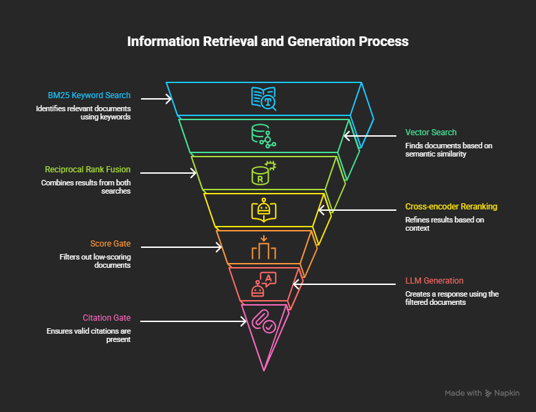

# RAG Research Studio

A production-grade Retrieval-Augmented Generation system that answers questions about RAG and retrieval research papers — with full observability, CI regression gating, and zero hallucinations on out-of-domain queries.

**Live Demo:** https://rag-research-studio.netlify.app
**Backend API:** https://codingpros-rag-on-rag-papers.hf.space/docs
**Frontend Repo:** https://github.com/Priyanka-Narang1/rag-research-studio-frontend

---

> "I built a RAG system whose corpus is 18 research papers about RAG itself — so every design decision was directly informed by the papers being retrieved."

---

## Pipeline Architecture



The pipeline funnels every query through 7 stages:

1. **BM25 Keyword Search** — exact term matching across 602 chunks
2. **Vector Search** — semantic similarity via `all-MiniLM-L6-v2`
3. **Reciprocal Rank Fusion** — merges both ranked lists (k=60, from Cormack et al. 2009)
4. **Cross-Encoder Reranking** — `ms-marco-MiniLM-L-6-v2` scores true relevance on top-30 candidates
5. **Score Gate** — abstains if best score < -2.5 (out-of-domain detection, no LLM call)
6. **LLM Generation** — Groq `llama3-8b-8192` with strict grounding prompt (v2.2)
7. **Citation Gate** — abstains if answer has zero valid citations (parametric knowledge detection)

---

## What Makes This Production-Grade

| Feature | Implementation |
|---|---|
| Hybrid retrieval | BM25 + vector search fused via Reciprocal Rank Fusion (k=60) |
| Reranking | cross-encoder/ms-marco-MiniLM-L-6-v2 on top-30 candidates |
| Citation enforcement | Every cited chunk ID verified against retrieved set in code |
| Two-layer hallucination prevention | Score gate + citation gate |
| Prompt versioning | YAML config files (v1 → v2.2), version logged per response |
| Observability | Langfuse Cloud — per-stage latency, cost, citations per request |
| Eval pipeline | 60-question golden dataset, LLM-as-judge, faithfulness 0.91 |
| CI regression gating | GitHub Actions — fails if faithfulness < 0.86 or precision < 0.71 |

---

## Corpus

18 arXiv papers on RAG and retrieval methods (2019–2026). All IDs verified via arXiv API before download — no blind trust in hardcoded IDs.

| Category | Papers |
|---|---|
| Foundational RAG | Lewis et al. (RAG), DPR, REALM |
| Late interaction retrieval | ColBERT, ColBERTv2 |
| Zero-shot retrieval | HyDE |
| Context handling | Lost in the Middle, Sentence-BERT |
| Adaptive RAG | Self-RAG, CRAG, RAFT, RAPTOR |
| Structured retrieval | GraphRAG |
| Evaluation | RAGAS, ARES |
| Query handling | Query Rewriting |
| Survey + benchmarks | RAG Survey, BM25-to-CRAG benchmark |

---

## Pipeline Details

### Ingestion & Chunking

- PyMuPDF extraction with `sort=True` for correct multi-column reading order
- Reference sections removed via heuristic pattern matching — **23.8% avg content removed** per paper
- **600 tokens, 100 token overlap**, `cl100k_base` tokenizer (same as GPT-4)
- Result: **602 clean chunks** across 18 papers

### Why Hybrid Retrieval

Pure vector search returned a bibliography chunk as #1 for "What is retrieval augmented generation?" Semantic similarity alone fails on technical corpora with dense citation patterns.

**Reciprocal Rank Fusion:**
```
score(chunk) = Σ 1 / (k + rank_in_retriever)   where k=60
```

Why RRF over score normalization: BM25 scores (0–15+) and cosine distances (0–1) are incomparable scales. RRF uses only rank positions.

### Two-Layer Hallucination Prevention

**Layer 1 — Score gate:** Best reranker score < -2.5 → abstain before calling LLM. Saves cost, catches out-of-domain queries early.

**Layer 2 — Citation gate:** Answer with zero valid citations → abstain. Catches cases where reranker returns plausible chunks but LLM answers from parametric memory anyway.

Real test results:
- "What is Anthropic's Constitutional AI?" → correctly abstains ✓
- "How does ChatGPT work internally?" → correctly abstains ✓
- "Explain GPT-4's architecture in detail" → correctly abstains ✓
- "What is retrieval augmented generation?" → grounded answer with citations ✓

---

## Evaluation

| Metric | Method | Score |
|---|---|---|
| **Faithfulness** | Decompose answer into claims → verify against context | **0.91** |
| **Context Precision** | LLM judges each chunk for relevance | **0.76** |
| Answer Relevancy | Cosine similarity (question ↔ answer) | 0.49* |

*Metric artifact — cosine similarity penalises short correct answers. Ragas library had breaking Python 3.13 conflicts so metrics were implemented directly — fully auditable.

60-question golden dataset, all answers verified against actual paper text before use.

---

## Observability (Langfuse)

Every request traced with three nested spans: `rag_query` → `retrieval` → `llm_generation`

### Measured Latency (CPU hardware, Groq free tier)

| Stage | p50 | p95 |
|---|---|---|
| Query embedding | 28ms | 123ms |
| BM25 search | 2ms | 3ms |
| Vector search | 2ms | 130ms |
| **Cross-encoder rerank** | **2786ms** | **3395ms** |
| **LLM generation** | **23690ms** | **40541ms** |
| **Total** | **26587ms** | **43295ms** |

Reranker bottleneck: CPU inference. On GPU → ~50ms. LLM bottleneck: Groq free tier throttling. Paid API → 1–3s. **Production estimate with GPU + paid API: ~3–5s total.**

Cost: $0.000168/query. At 10,000 queries/day: ~$1.68/day.

---

## CI Regression Gating

GitHub Actions runs the full eval pipeline on every push. Build fails if:
- Faithfulness < **0.86** (5% below baseline of 0.91)
- Context precision < **0.71** (5% below baseline of 0.76)

---

## Failure Modes & Mitigations

| Failure | Detection | Mitigation |
|---|---|---|
| Out-of-domain question | Reranker score < -2.5 | Abstain before LLM call |
| LLM uses parametric knowledge | Zero valid citations | Citation gate → abstention |
| Bibliography chunks retrieved | Reference section heuristic | 23.8% avg content removed at ingest |
| Vector search misses exact terms | BM25 as keyword complement | Hybrid RRF retrieval |
| Answer quality regression | CI eval gate on every push | Fail build, require justification |

---

## Known Limitations

1. **RAGAS metrics question** — RAG survey's citation-dense comparison table ranks higher than the RAGAS paper's core content chunk. Fixable with metadata-aware retrieval or paper-level boosting.
2. **CPU latency** — reranker 2.8s p50 and LLM 23s p50 improve dramatically with GPU and paid API.
3. **8B model reasoning** — llama3-8b-8192 occasionally produces generic answers even when context is specific. A 70B model would improve synthesis quality.

---

## Project Structure

```
rag-papers/
|-- src/
|   |-- fetch_papers.py         # Verify arXiv IDs via API (no blind trust)
|   |-- download_pdfs.py        # Download verified PDFs
|   |-- extract_text.py         # PyMuPDF text extraction
|   |-- clean_texts.py          # Reference section removal (23.8% avg)
|   |-- chunk_texts.py          # Token-based chunking (600/100 overlap)
|   |-- embed_chunks.py         # all-MiniLM-L6-v2 → ChromaDB
|   |-- bm25_retriever.py       # BM25 index
|   |-- hybrid_retriever.py     # RRF fusion
|   |-- reranker.py             # Cross-encoder reranking
|   |-- answer_generator.py     # Citation-enforced generation
|   |-- rag_pipeline.py         # Full pipeline + Langfuse tracing
|   |-- evaluate.py             # LLM-as-judge eval (faithfulness/precision)
|   `-- api.py                  # FastAPI wrapper (deployed on HF Spaces)
|-- prompts/
|   `-- v2.yaml                 # Versioned prompt config (v2.2)
|-- eval/
|   |-- golden_dataset.json     # 60 verified QA pairs
|   `-- eval_results.json       # Latest eval scores
|-- data/
|   `-- verified_papers.tsv     # 18 arXiv IDs + titles (API-verified)
|-- screenshots/
|   `-- architecture.png        # Pipeline architecture diagram
`-- .github/workflows/
    `-- eval.yml                # CI regression gate
```

---

## Setup

```bash
git clone https://github.com/Priyanka-Narang1/Rag-on-Rag-Papers
cd Rag-on-Rag-Papers
pip install sentence-transformers chromadb rank-bm25 groq numpy pyyaml pymupdf tiktoken langfuse fastapi uvicorn

echo "GROQ_API_KEY=your_key" >> .env

# Build corpus (~5 min)
python src/fetch_papers.py
python src/download_pdfs.py
python src/extract_text.py
python src/clean_texts.py
python src/chunk_texts.py
python src/embed_chunks.py
python src/bm25_retriever.py

# Run API locally
uvicorn src.api:app --reload --port 8000

# Run eval
python src/evaluate.py
```

---

## Key Design Decisions

**Why hand-roll retrieval instead of LangChain?** LangChain abstracts the mechanics that matter in production — how scores are fused, what happens when reranking disagrees, how citation verification works. Building from first principles means every component is explainable in an interview.

**Why two abstention gates?** A single gate isn't enough. The score gate catches out-of-domain questions before the LLM call (cost-efficient). The citation gate catches cases where the LLM answers from parametric memory despite retrieving plausible-looking chunks. Both are needed for trustworthy grounding.

**Why custom eval instead of Ragas?** Ragas 0.1.x has breaking dependency conflicts with Python 3.13 and modern langchain versions. Implementing faithfulness and context precision directly makes the eval logic fully auditable — not a black box.

**Why this corpus?** Every retrieval design decision was directly informed by reading the papers being retrieved. The system was built with domain knowledge, not just copied from a tutorial.
